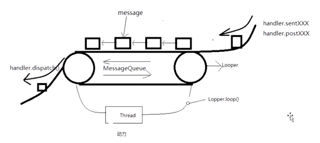

##Android Looper 与 epoll

### 1.handler 模型

 Android 中的线程切换，消息传递机制，主要依赖于以下几个角色：

Handler：处理者，负责分发消息，处理消息

Message：消息对象

MessageQueue：消息队列，每个Looper持有自己的消息队列

Looper+Thread：循环者，负责从MessageQueue中取出消息，线程推动looper工作的动力。




```java
Handler.sendXXXX  -----> MessageQueue.enqueueMessage(); //消息入队

ActivityThread--->Looper.loop() ------->MessageQueue.next()  //消息出队列

Looper.prepare() ---> ThreadLocal.set() //使用ThreadLocal 保证每个looper 绑定一个线程
```

**问题1：为何是主线程Handler ，HandlerThread，不需要手动调用Loop.loop()？**

主线程会在ActivityThread main() 方法中，调用Loop.loop()启动主线程的looper；

HandlerThread 会在线程start后，当获取到CPU时间片后，又nativeThread回调javaThread的run方法，对应到HandlerThread的run()，可以看到里面调用 Looper.loop();

```java
@Override
public void run() {
    mTid = Process.myTid();
    Looper.prepare();
    synchronized (this) {
        mLooper = Looper.myLooper();
        notifyAll();
    }
    Process.setThreadPriority(mPriority);
    onLooperPrepared();
    Looper.loop();//启动handlerThread的Looper
    mTid = -1;
}
```

如果是在Thread 中使用Handler和Looper，需要手动调用Loop.loop();例如:

```java
 new Thread(() -> {
     Looper.prepare();
     h = new Handler(Looper.myLooper()){
       @Override
       public void handleMessage(Message msg) {
         Log.d("TAG=========", "handleMessage: " + msg);
         Log.d("TAG=========", "handleMessage: "+Thread.currentThread());
       }
     };
     Looper.loop();//手动调用，启动looper开始工作
     h.sendEmptyMessage(1000);
 }).start();
```

### 2.handler 详解

#### 2.1Handler sendXXXXXX;

```java
 private boolean enqueueMessage(MessageQueue queue, Message msg, long uptimeMillis) {
        msg.target = this;
        if (mAsynchronous) {
            msg.setAsynchronous(true);
        }
        return queue.enqueueMessage(msg, uptimeMillis);
    }

 boolean enqueueMessage(Message msg, long when) {
        if (msg.target == null) {
            throw new IllegalArgumentException("Message must have a target.");
        }
        if (msg.isInUse()) {
            throw new IllegalStateException(msg + " This message is already in use.");
        }

        synchronized (this)//防止多个子线程同时入队出现问题
        {
         ....
        }
 }
```

####2.2.主线程 looper.loop();

```java
for (;;) { // 死循环为什么不会导致主线程卡死？
    Message msg = queue.next(); // might block
    if (msg == null) {
        // No message indicates that the message queue is quitting.
        return;
    }

    // This must be in a local variable, in case a UI event sets the logger
    final Printer logging = me.mLogging;
    if (logging != null) {
        logging.println(">>>>> Dispatching to " + msg.target + " " +
                msg.callback + ": " + msg.what);
    }
```

```java
D/TAG=========: Queue: android.os.MessageQueue@8aa5dc2 //looper中的MessageQueue
D/TAG=========: reflectHandler: android.os.MessageQueue@8aa5dc2 // 反射获取Handler中MessageQueue
```

**注意：synchronized (this) ， this----> looper 的MessageQueue，入队和出队，锁为同一个对象（MessageQueue）,说明MessageQueue不允许同时进出队列**

```java
Message next() {
    int pendingIdleHandlerCount = -1; // -1 only during first iteration
    int nextPollTimeoutMillis = 0;
    for (;;) {
        if (nextPollTimeoutMillis != 0) {
            Binder.flushPendingCommands();
        }
        nativePollOnce(ptr, nextPollTimeoutMillis);
        synchronized (this) //从队列中取出数据时，禁止同时入队，防止同时操作出现问题。
        {
        ...
        }
```

####2.3 死循环为什么不会导致主线程卡死？

```java
private native void nativePollOnce(long ptr, int timeoutMillis); // 休眠
private native static void nativeWake(long ptr);//唤醒
```

这里就涉及到 Linux pipe/epoll 机制。在主线程的 MessageQueue 没有消息时，便阻塞在 `MessageQueue.next()` 中的 `nativePollOnce()` 方法里，此时主线程会释放 CPU 资源进入休眠状态，直到下个消息到达或者有事务发生，通过往 pipe 管道写端写入数据来唤醒主线程工作。这里采用的 epoll 机制，是一种 IO 多路复用机制，可以同时监控多个描述符，当某个描述符就绪（读或写就绪），则立刻通知相应程序进行读或写操作，即读写是阻塞的。所以主线程大多数时候都是处于休眠状态，并不会消耗大量 CPU 资源。

#####2.3.1.epoll基础知识介绍

epoll机制提供了Linux平台上最高效的I/O复用机制，因此有必要介绍一下它的基础知识。
从调用方法上看，epoll的用法和select/poll非常类似，其主要作用就是I/O复用，即在一个地方等待多个文件句柄的I/O事件。
下面通过一个简单例子来分析epoll的工作流程。

#####2.3.2.epoll工作流程分析案例

```c++
/*
使用epoll前，需要先通过epoll_create函数创建一个epoll句柄。
下面一行代码中的10表示该epoll句柄初次创建时候分配能容纳10个fd相关信息的缓存。
对于2.6.8版本以后的内核，该值没有实际作用，这里可以忽略。其实这个值的主要目的是
确定分配一块多大的缓存。现在的内核都支持动态拓展这块缓存，所以该值就没有意义了
*/ 
int epollHandle = epoll_create(10);

/*
   得到epoll句柄后，下一步就是通过epoll_ctl把需要监听的文件句柄加入到epoll句柄中。
   除了指定文件句柄本身的fd值外，同时还需要指定在该fd上等待什么事件。epoll支持四类事件，
  分别是EPOLLIN(句柄可读)、EPOLLOUT(句柄可写),EPOLLERR(句柄错误)、EPOLLHUP(句柄断)。
   epoll定义了一个结构体struct epoll_event来表达监听句柄的诉求。
   假设现在有一个监听端的socket句柄listener，要把它加入到epoll句柄中。
 */
 structepoll_event listenEvent; //先定义一个event
 /*
 EPOLLIN表示可读事件,EPOLLOUT表示可写事件，另外还有EPOLLERR,EPOLLHUP表示
 系统默认会将EPOLLERR加入到事件集合中
 */
 listenEvent.events= EPOLLIN;//指定该句柄的可读事件
 //epoll_event中有一个联合体叫data，用来存储上下文数据，本例的上下文数据就是句柄自己
 listenEvent.data.fd= listenEvent;
/*
 EPOLL_CTL_ADD将监听fd和监听事件加入到epoll句柄的等待队列中；
 EPOLL_CTL_DEL将监听fd从epoll句柄中移除；
 EPOLL_CTL_MOD修改监听fd的监听事件，例如本来只等待可读事件，现在需要同时等待
可写事件，那么修改listenEvent.events 为EPOLLIN|EPOLLOUT后，再传给epoll句柄
 */
 epoll_ctl(epollHandle,EPOLL_CTL_ADD,listener,&listenEvent);
 /*
 当把所有感兴趣的fd都加入到epoll句柄后，就可以开始坐等感兴趣的事情发生了。
 为了接收所发生的事情，先定义一个epoll_event数组
 */
struct  epoll_eventresultEvents[10];
 inttimeout = -1;
 while(1)
 {
    /*
    调用epoll_wait用于等待事件，其中timeout可以指定一个超时时间，
    resultEvents用于接收发生的事件，10为该数组的大小。
     epoll_wait函数的返回值有如下含义：
     nfds大于0表示所监听的句柄上有事件发生；
     nfds等于0表示等待超时；
     nfds小于0表示等待过程中发生了错误
    */
 int nfds= epoll_wait(epollHandle, resultEvents, 10, timeout);
 if(nfds== -1)
 {
    // epoll_wait发生了错误
 }
 elseif(nfds == 0)
 {
    //发生超时，期间没有发生任何事件
 }
 else
 {
    //resultEvents用于返回那些发生了事件的信息
    for(int i = 0; i < nfds; i++)
    {
       struct epoll_event & event =resultEvents[i];
       if(event & EPOLLIN)
      {
          /*
           收到可读事件。到底是哪个文件句柄发生该事件呢？可通过event.data这个联合体取得
            之前传递给epoll的上下文数据，该上下文信息可用于判断到底是谁发生了事件。
          */
      }
       .......//其他处理 
    }
 }

}
```

#####2.3.3.源码中的epoll原理

```c++
/Users/liudawei/worksapace/source_code/platform_frameworks_base/core/jni/android_os_MessageQueue.cpp // C++ 文件，动态注册
static const JNINativeMethod gMessageQueueMethods[] = {
    /* name, signature, funcPtr */
    { "nativeInit", "()J", (void*)android_os_MessageQueue_nativeInit },
    { "nativeDestroy", "(J)V", (void*)android_os_MessageQueue_nativeDestroy },
    { "nativePollOnce", "(JI)V", (void*)android_os_MessageQueue_nativePollOnce },
    { "nativeWake", "(J)V", (void*)android_os_MessageQueue_nativeWake },
    { "nativeIsPolling", "(J)Z", (void*)android_os_MessageQueue_nativeIsPolling },
    { "nativeSetFileDescriptorEvents", "(JII)V",
    (void*)android_os_MessageQueue_nativeSetFileDescriptorEvents },
};
....
static void android_os_MessageQueue_nativePollOnce(JNIEnv* env, jobject obj,
        jlong ptr, jint timeoutMillis) {
    NativeMessageQueue* nativeMessageQueue = reinterpret_cast<NativeMessageQueue*>(ptr);
  //取出NativeMessageQueue对象，并调用它的pollOnce
    nativeMessageQueue->pollOnce(env, obj, timeoutMillis);
}
....
#include <utils/Looper.h> //此处指向源码中的Utils包下
void NativeMessageQueue::pollOnce(JNIEnv* env, jobject pollObj, int timeoutMillis) {
    mPollEnv = env;
    mPollObj = pollObj;
    mLooper->pollOnce(timeoutMillis); // c++ looper对象调用pollOnce
    mPollObj = NULL;
    mPollEnv = NULL;
    if (mExceptionObj) {
        env->Throw(mExceptionObj);
        env->DeleteLocalRef(mExceptionObj);
        mExceptionObj = NULL;
    }
}
//utils中 pollOnce方法
//timeOutMillis参数为超时等待时间。如果为-1，则表示无限等待，直到有事件发生为止。如果值为0，则无需等待立即返回。
//outFd用来存储发生事件的那个文件描述符。
//outEvents用来存储在该文件描述符[[1]上发生了哪些事件，目前支持可读、可写、错误和中断4个事件。这4个事件其实是从epoll事件转化而来。后面我们会介绍大名鼎鼎的epoll。
//outData用于存储上下文数据，这个上下文数据是由用户在添加监听句柄时传递的，它的作用和pthread_create函数最后一个参数param一样，用来传递用户自定义的数据。
int Looper::pollOnce(int timeoutMillis, int* outFd, int* outEvents, void** outData) {
    int result = 0;
    for (;;) {////一个无限循环
        //mResponses是一个Vector，这里首先需要处理response
        while (mResponseIndex < mResponses.size()) {
            const Response& response = mResponses.itemAt(mResponseIndex++);
            int ident = response.request.ident;//ident是这个Response的id
            if (ident >= 0) {//处理id大于等于0的Response
                int fd = response.request.fd;
                int events = response.events;
                void* data = response.request.data;
                if (outFd != nullptr) *outFd = fd;
                if (outEvents != nullptr) *outEvents = events;
                if (outData != nullptr) *outData = data;
                return ident;
            }
        }
        if (result != 0) {
            if (outFd != nullptr) *outFd = 0;
            if (outEvents != nullptr) *outEvents = 0;
            if (outData != nullptr) *outData = nullptr;
            return result;
        }
        //调用pollInner函数。注意，它在for循环内部
        result = pollInner(timeoutMillis);
    }
}
```

```c++
int Looper::pollInner(int timeoutMillis) {
#if DEBUG_POLL_AND_WAKE
    ALOGD("%p ~ pollOnce - waiting: timeoutMillis=%d", this, timeoutMillis);
#endif
    // Adjust the timeout based on when the next message is due.
    if (timeoutMillis != 0 && mNextMessageUptime != LLONG_MAX) {
        nsecs_t now = systemTime(SYSTEM_TIME_MONOTONIC);
        int messageTimeoutMillis = toMillisecondTimeoutDelay(now, mNextMessageUptime);
        if (messageTimeoutMillis >= 0
                && (timeoutMillis < 0 || messageTimeoutMillis < timeoutMillis)) {
          //根据Native Message的信息计算此次需要等待的时间
            timeoutMillis = messageTimeoutMillis;
        }
#if DEBUG_POLL_AND_WAKE
        ALOGD("%p ~ pollOnce - next message in %" PRId64 "ns, adjusted timeout: timeoutMillis=%d",
                this, mNextMessageUptime - now, timeoutMillis);
#endif
    }
    // Poll.
    int result = POLL_WAKE;
    mResponses.clear();
    mResponseIndex = 0;
    // We are about to idle.
    mPolling = true;
    struct epoll_event eventItems[EPOLL_MAX_EVENTS];
    int eventCount = epoll_wait(mEpollFd.get(), eventItems, EPOLL_MAX_EVENTS, timeoutMillis);
    // No longer idling.
    mPolling = false;
    // Acquire lock.
    mLock.lock();
    // Rebuild epoll set if needed.
    if (mEpollRebuildRequired) {
        mEpollRebuildRequired = false;
        rebuildEpollLocked();
        goto Done;
    }
    // Check for poll error.
    if (eventCount < 0) {
        if (errno == EINTR) {
            goto Done;
        }
        ALOGW("Poll failed with an unexpected error: %s", strerror(errno));
        result = POLL_ERROR;
        goto Done;
    }
    // Check for poll timeout.
    if (eventCount == 0) {
#if DEBUG_POLL_AND_WAKE
        ALOGD("%p ~ pollOnce - timeout", this);
#endif
        result = POLL_TIMEOUT;
        goto Done;
    }
    // Handle all events.
#if DEBUG_POLL_AND_WAKE
    ALOGD("%p ~ pollOnce - handling events from %d fds", this, eventCount);
#endif
    for (int i = 0; i < eventCount; i++) {
        int fd = eventItems[i].data.fd;
        uint32_t epollEvents = eventItems[i].events;
        if (fd == mWakeEventFd.get()) {
            if (epollEvents & EPOLLIN) {
                awoken();
            } else {
                ALOGW("Ignoring unexpected epoll events 0x%x on wake event fd.", epollEvents);
            }
        } else {
            ssize_t requestIndex = mRequests.indexOfKey(fd);
            if (requestIndex >= 0) {
                int events = 0;
                if (epollEvents & EPOLLIN) events |= EVENT_INPUT;
                if (epollEvents & EPOLLOUT) events |= EVENT_OUTPUT;
                if (epollEvents & EPOLLERR) events |= EVENT_ERROR;
                if (epollEvents & EPOLLHUP) events |= EVENT_HANGUP;
                pushResponse(events, mRequests.valueAt(requestIndex));
            } else {
                ALOGW("Ignoring unexpected epoll events 0x%x on fd %d that is "
                        "no longer registered.", epollEvents, fd);
            }
        }
    }
Done: ;
    // Invoke pending message callbacks.
    mNextMessageUptime = LLONG_MAX;
    while (mMessageEnvelopes.size() != 0) {
        nsecs_t now = systemTime(SYSTEM_TIME_MONOTONIC);
        const MessageEnvelope& messageEnvelope = mMessageEnvelopes.itemAt(0);
        if (messageEnvelope.uptime <= now) {
            // Remove the envelope from the list.
            // We keep a strong reference to the handler until the call to handleMessage
            // finishes.  Then we drop it so that the handler can be deleted *before*
            // we reacquire our lock.
            { // obtain handler
                sp<MessageHandler> handler = messageEnvelope.handler;
                Message message = messageEnvelope.message;
                mMessageEnvelopes.removeAt(0);
                mSendingMessage = true;
                mLock.unlock();

#if DEBUG_POLL_AND_WAKE || DEBUG_CALLBACKS
                ALOGD("%p ~ pollOnce - sending message: handler=%p, what=%d",
                        this, handler.get(), message.what);
#endif
                handler->handleMessage(message);
            } // release handler

            mLock.lock();
            mSendingMessage = false;
            result = POLL_CALLBACK;
        } else {
            // The last message left at the head of the queue determines the next wakeup time.
            mNextMessageUptime = messageEnvelope.uptime;
            break;
        }
    }

    // Release lock.
    mLock.unlock();

    // Invoke all response callbacks.
    for (size_t i = 0; i < mResponses.size(); i++) {
        Response& response = mResponses.editItemAt(i);
        if (response.request.ident == POLL_CALLBACK) {
            int fd = response.request.fd;
            int events = response.events;
            void* data = response.request.data;
#if DEBUG_POLL_AND_WAKE || DEBUG_CALLBACKS
            ALOGD("%p ~ pollOnce - invoking fd event callback %p: fd=%d, events=0x%x, data=%p",
                    this, response.request.callback.get(), fd, events, data);
#endif
            // Invoke the callback.  Note that the file descriptor may be closed by
            // the callback (and potentially even reused) before the function returns so
            // we need to be a little careful when removing the file descriptor afterwards.
            int callbackResult = response.request.callback->handleEvent(fd, events, data);
            if (callbackResult == 0) {
                removeFd(fd, response.request.seq);
            }

            // Clear the callback reference in the response structure promptly because we
            // will not clear the response vector itself until the next poll.
            response.request.callback.clear();
            result = POLL_CALLBACK;
        }
    }
    return result;
}
```

pollOnce函数的返回值也具有特殊的意义，具体如下：

- 当返回值为  `POLL_WAKE时`，表示这次返回是由wake函数触发的，也就是管道写端的那次写事件触发的。
- 返回值为`POLL_TIMEOUT` 表示等待超时。
- 返回值为`POLL_ERROR`，表示等待过程中发生错误。
  返回值为`POLL_CALLBACK`，表示某个被监听的句柄因某种原因被触发。这时，`outFd`参数用于存储发生事件的文件句柄，outEvents用于存储所发生的事件。
  上面这些知识是和epoll息息相关的。

```c++
static void android_os_MessageQueue_nativeWake(JNIEnv* env, jclass clazz, jlong ptr) {
    NativeMessageQueue* nativeMessageQueue = reinterpret_cast<NativeMessageQueue*>(ptr);
    nativeMessageQueue->wake();
}

void NativeMessageQueue::wake() {
    mLooper->wake();
}

//utils/looper
void Looper::wake() {
#if DEBUG_POLL_AND_WAKE
    ALOGD("%p ~ wake", this);
#endif

    uint64_t inc = 1;
    ssize_t nWrite = TEMP_FAILURE_RETRY(write(mWakeEventFd.get(), &inc, sizeof(uint64_t)));
    if (nWrite != sizeof(uint64_t)) {
        if (errno != EAGAIN) {
            LOG_ALWAYS_FATAL("Could not write wake signal to fd %d (returned %zd): %s",
                             mWakeEventFd.get(), nWrite, strerror(errno));
        }
    }
}
//以下为 API 21的源码；由于在高版本的Android 上进行了封装，找实现比较麻烦这里贴上低版本的代码，供理解原理
void Looper::wake() {
#if DEBUG_POLL_AND_WAKE
    ALOGD("%p ~ wake", this);
#endif

    ssize_t nWrite;
    do {
        nWrite = write(mWakeWritePipeFd, "W", 1);//向管道的写端写入一个字符,唤醒epoll wait
    } while (nWrite == -1 && errno == EINTR);

    if (nWrite != 1) {
        if (errno != EAGAIN) {
            ALOGW("Could not write wake signal, errno=%d", errno);
        }
    }
}
```

### 3.参考资料

1.《深入理解Android 卷二》，邓凡平 